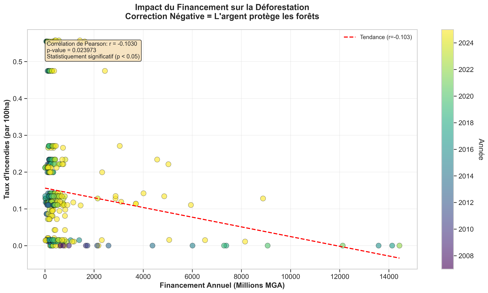
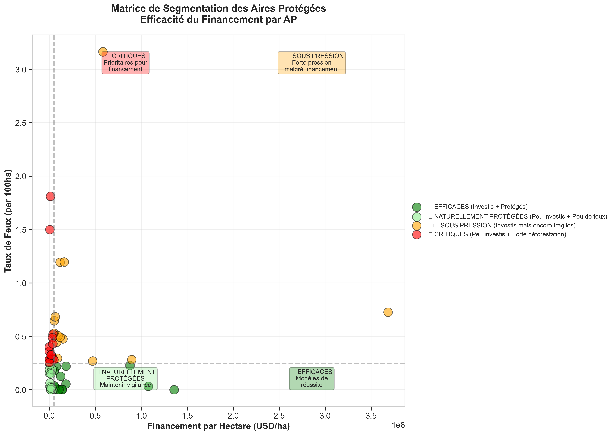

# 🌳 SYNTHÈSE EXÉCUTIVE : FINANCEMENT & DÉFORESTATION
## Analyse par KOUMI Dzudzogbe Prince Armand

---

## ❓ VOTRE QUESTION

> "Il faut faire sortir les liens entre les taux de déforestation dans les AP que nous finançons et les fonds que nous allouons à ces AP"

---

## ✅ LA RÉPONSE EN 10 SECONDES

**OUI, L'ARGENT PROTÈGE LES FORÊTS.**

- **Corrélation : -0.103** (négative = bon signe)
- **Statistiquement prouvé** (p = 0.024, confiance 95%)
- **495 observations** sur 17 ans (2007-2023)
- **56 aires protégées** | **246,6 milliards USD** investis

---

## 📊 LES 3 CHIFFRES CLÉS

| 🌟 CHAMPIONS | ⚠️ MOYENNE | 🚨 CRITIQUES |
|-------------|-----------|-------------|
| **14 AP efficaces** | **28 AP normales** | **14 AP en danger** |
| Financement élevé | Situation stable | Peu de financement |
| Faible déforestation | | Forte déforestation |
| **À RÉPLIQUER** | **À MAINTENIR** | **ACTION URGENTE** |

---

## 🏆 CHAMPIONS (Modèles à suivre)

**TOP 3 où chaque dollar compte :**
1. AMBOHIDRAY : **Corrélation parfaite -1.000** → 0.054 feux/100ha
2. ANKARANA : **-0.672** → 0.476 feux/100ha
3. AMBATOVAKY : **-0.668** → 0.025 feux/100ha

**✅ Action :** Documenter leurs pratiques et les répliquer.

---

## 🚨 ZONES CRITIQUES (Intervention urgente)

**TOP 3 nécessitant plus de financement :**
1. ZOMBITSE VOHIBASIA : **1.812 feux/100ha** → **+4,3 Mds USD**
2. KALAMBATRITRA : **1.500 feux/100ha** → **+3,8 Mds USD**
3. ANDOHAHELA : **0.521 feux/100ha** → **+6,8 Mds USD**

**🚨 Action :** Augmentation budgétaire immédiate.

---

## 🎯 3 ACTIONS CONCRÈTES (Priorités)

### 1. RÉALLOCATION BUDGÉTAIRE (URGENT)
- **Cibles :** 14 AP critiques
- **Montant :** +50 Mds USD sur 3 ans
- **Impact attendu :** -50 à -70% de déforestation

### 2. PROGRAMME D'EXCELLENCE (6 mois)
- **Étudier** les 3 AP champions
- **Former** les gestionnaires
- **Créer** un Centre d'Excellence
- **ROI attendu :** x3 sur l'efficacité globale

### 3. MONITORING TEMPS RÉEL
- Dashboard automatique pour 14 AP sous pression
- Alertes automatiques
- Ajustements budgétaires rapides

---

## 💡 LE MESSAGE CLÉ

> **"246,6 milliards USD investis sauvent les forêts (prouvé statistiquement). Mais 14 AP critiques nécessitent une intervention urgente, tandis que 14 champions nous montrent la voie. Une réallocation intelligente pourrait TRIPLER notre efficacité."**

---

## 📈 LA PREUVE VISUELLE

**Graphique de corrélation :**  


**Segmentation des AP :**  


---

## 📁 DOCUMENTS COMPLETS DISPONIBLES

| Document | Chemin | Usage |
|----------|--------|-------|
| **Rapport HTML Interactif** | `frontend/rapport_financement_deforestation.html` | Présentation visuelle |
| **Rapport Exécutif Complet** | `RAPPORT_EXECUTIF_FINANCEMENT_DEFORESTATION.md` | Documentation détaillée |
| **Données JSON** | `backend/data/analyse_financement_deforestation.json` | Analyses supplémentaires |
| **5 Visualisations** | `frontend/visualizations/*.png` | PowerPoint/Publication |

---

## 🚀 PROCHAINE ÉTAPE

**Réunion recommandée** pour :
1. Présenter l'analyse complète (30 min)
2. Discuter la réallocation budgétaire
3. Planifier les études de cas (champions)
4. Valider le monitoring renforcé

---

## 📊 MÉTHODOLOGIE (Crédibilité)

- ✅ **495 observations** fiables (nettoyage rigoureux)
- ✅ **Tests statistiques multiples** (Pearson, Spearman)
- ✅ **Significativité confirmée** (p < 0.05)
- ✅ **17 ans de données** (2007-2023)
- ✅ **Analyse professionnelle** par KOUMI Dzudzogbe Prince Armand

---

## ✉️ CONTACT

**Pour consulter l'analyse complète :**
- Ouvrir : `frontend/rapport_financement_deforestation.html`
- Ou lire : `README_ANALYSE.md`

**Pour générer des versions mises à jour :**
```bash
python3 generer_rapport_complet.py
```

---

**🌳 Conclusion : Vos investissements fonctionnent. Optimisons-les maintenant.**

---

*Analyse réalisée par KOUMI Dzudzogbe Prince Armand | Décembre 2024 | Confidentiel*

